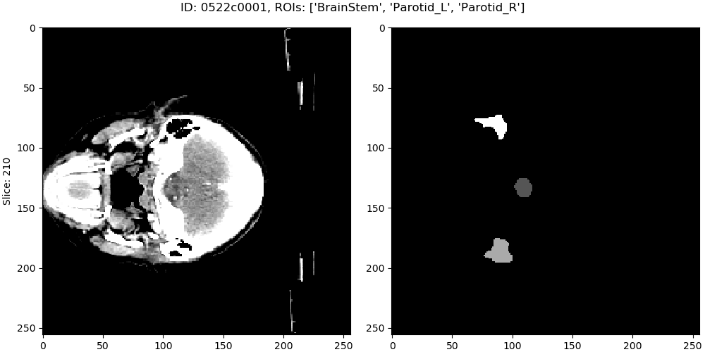
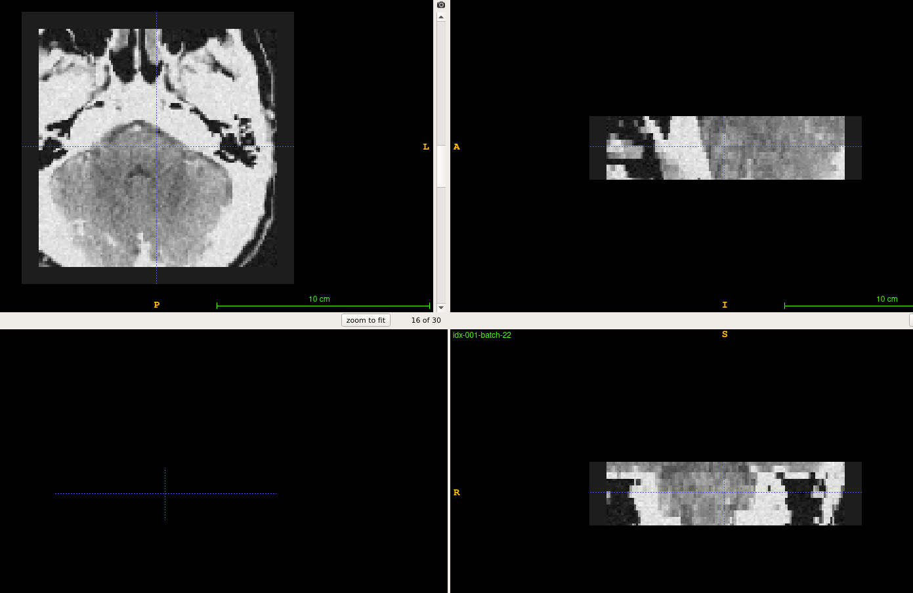

# Medical Image Data Pipeline

This project is designed for the data feeding for deep learning models based on PyTorch.
Still under development, use it with caution.

## Installation

The used python version is 3.7.  One can install this package locally by cloning the repo and running

```bash
python setup.py install --user
```

or install it by pip

```bash
pip install git+https://github.com/YuanYuYuan/MIDP
```

## Prepare data

### Dataset

In the following examples, we use the [PDDCA](http://www.imagenglab.com/newsite/pddca/) dataset, and name it as _data_.
The structure of PDDCA dataset is like the following and in NRRD data format(.nrrd). We have written a parser named _PDDCA parser_ for this dataset.

One can directly use parser to serve the data loading or convert the source data to a consistent format.
In this project, we choose the NIfTI format(.nii.gz) for the purpose of better integration.

### Data conversion


#### Conversion: NRRD to NIfTI

The following one demos how to transfer the NRRD dataset to NIfTI dataset

```bash
./nrrd2nifti.py --config configs/nrrd2nifti.yaml
```

with a sample configuration  _configs/nrrd2nifti.yaml_.

```yaml
# Input directory containing NRRD data
data_dir: ./data

# Output directory storing NIfTI data
output_dir: ./nifti

# Unit: mm
spacing: 1

# TODO: correct ROIs to classes
# Map each structure to specified value
# For PDDCA dataset, there're
#   Mandible        : 1
#   BrainStem       : 2
#   Parotid_L       : 3
#   Parotid_R       : 4
#   Submandibular_L : 5
#   Submandibular_R : 6
#   OpticNerve_L    : 7
#   OpticNerve_R    : 8
#   Chiasm          : 9
# But note that some cases in PDDCA dataset may not contain all structures.
roi_map:
  BrainStem       : 1
  Parotid_L       : 2
  Parotid_R       : 3
```

After converted, the output in NIfTI format should be located at the `output_dir` (_nifti_ in this example).


#### Conversion: NIfTI back to NRRD

When doing backward conversion from NIfTI to NRRD, it requires the information of the original dataset,
so you should specify the source data directory(_data_ in this example).
The following one demo how to use the program to convert the label from NIfTI to NRRD.

```bash
./nifti2nrrd.py --nrrd-dir data --nifti-dir nifti/labels --output-dir restored
```


## Examples

The followings show some basic manipulation with this library.

### Example 1: Test data loader

Directly use parser to load data

```bash
./sample_loader.py --loader-config configs/parsing_loader.yaml
```

or use NIfTI data loader(but required [conversion](#data-conversion) beforehand).

```bash
./sample_loader.py --loader-config configs/nifti_loader.yaml
```

This program will launch a viewer of the data, you can scroll the mouse wheel to change the slice.



### Example 2: Test data generator


Directly use parser to load data

```bash
./sample_generator.py \
    --loader-config configs/parsing_loader.yaml \
    --generator-config configs/generator.yaml
```

or use NIfTI data loader(but required [conversion](#data-conversion) beforehand)

```bash
./sample_generator.py \
    --loader-config configs/nifti_loader.yaml \
    --generator-config configs/generator.yaml
```

with a example generator config _configs/generator.yaml_.

```yaml
BlockSampler   :                  # sample a 3D block from each data(3D image)
  shuffle      : True             # shuffle the data list
  block_shape  : [128, 128, 30]   # the shape of observing area, i.e shape of image
  out_shape    : [96, 96, 20]     # the valid shape of the block, i.e. shape of label
  n_samples    : 32               # number of samples of each data
  ratios       : [0, 1, 2, 2]     # sampling probability of each class, note the lenght should be the same with the number of classes
  n_workers    : 2                # number of multi-thread workers
  verbose      : False            # toggle the debug info of this generator

Augmentor      :                  # do preprocessing and data augmentation
  zoom_range   : [0.8, 1.2]       # zoom the image/label with some scale in range, note that it only apply on x-y plane
  transpose    : True             # transpose the image/label on x-y plane with a fixed probability 0.5
  flip         : True             # flip the image/only on x-y plane with a fixed probability 0.5
  noise        : True             # add a Gaussian noise with mean 0 and sigam 0.05 on the image
  window_width : [90, 110]        # adjust the contrast with the given window width(or a range), default : 100
  window_level : [40, 60]         # adjust the contrast with the given window level(or a range), default : 50
  n_workers    : 2                # number of multi-thread workers
  verbose      : False            # toggle the debug info of this generator

BatchGenerator :                  # pack the processed data into batches
  batch_size   : 32               # batch size
  n_workers    : 2                # number of multi-thread workers
  verbose      : False            # toggle the debug info of this generator
```

The output files are stored in 3D NIfTI (nii.gz) in the _outputs_folder.
One may view these images by [ITK-SNAP](http://www.itksnap.org/pmwiki/pmwiki.php).

For example,




### Example 3: Generate data list for training

Generate data list by parsing loader.

```bash
./generate_data_list.py --loader-config configs/parsing_loader.yaml --output data_list.yaml
```

Sample output: _data\_list.yaml_

```yaml
amount:
  test: 0
  total: 3
  train: 2
  valid: 1
list:
  test: []
  train:
  - 0522c0001
  - 0522c0002
  valid:
  - 0522c0003
loader:
  name: ParsingLoader
  parser_config:
  - ROIs:
    - BrainStem
    - Parotid_L
    - Parotid_R
    data_dir: data
    data_list: test
    name: PDDCAParser
    preprocess_image: false
```

Generate data list by nifti loader.


```bash
./generate_data_list.py --loader-config configs/nifti_loader.yaml --output data_list.yaml
```

Sample output: _data\_list.yaml_

```yaml
amount:
  test: 0
  total: 2
  train: 1
  valid: 1
list:
  test: []
  train:
  - 0522c0598
  valid:
  - 0522c0576
loader:
  data_dir: nifti
  name: NIfTILoader
```

## For training

A sample structure has been written in _sample_train.py_ with a example config _configs/training.yaml_.

```bash
./sample_train.py --config configs/training.yaml
```

Note that the _config/training.yaml_ assumes a data list file at _data_list.yaml_.


