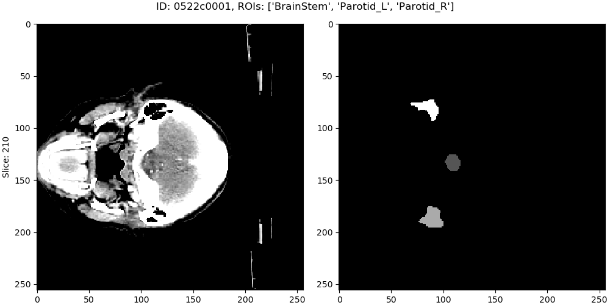
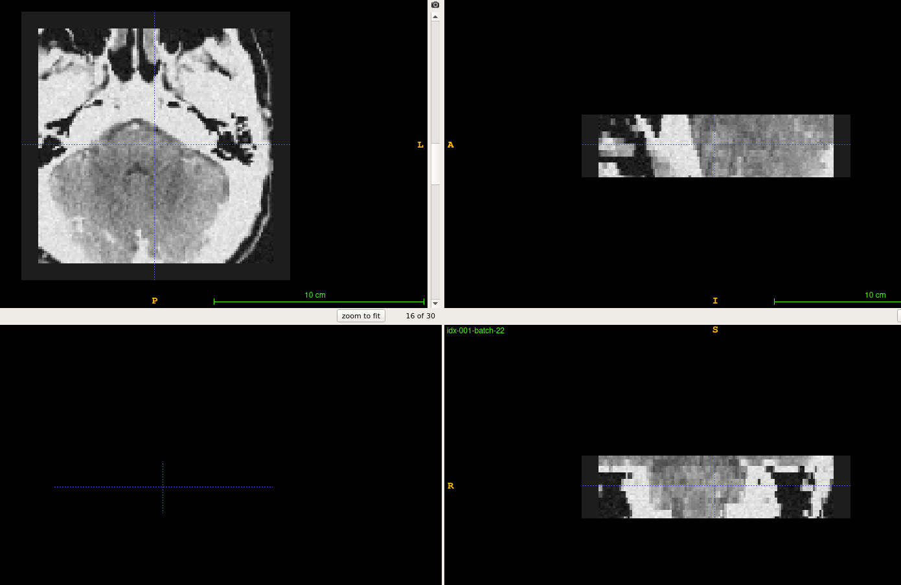

= Usage
:toc: left
:toclevels: 3
:docinfo:
:icons: font
:source-highlighter: rouge
:rouge-style: thankful_eyes
:sectnums:
:sectlinks:
:sectanchors:

This document lists some useful examples about using MIDP.

== Preparation

=== Package installation

The used python version is 3.7.  One can install this package locally by cloning the repo and running

    python setup.py install --user

or install it by pip

    pip install git+https://github.com/YuanYuYuan/MIDP

=== Download sample dataset

In the following examples,
we use the http://www.imagenglab.com/newsite/pddca[PDDCA] dataset as the sample dataset, and name it as _data_.

The structure of PDDCA dataset is like the following and in NRRD data format(.nrrd).

[source, console]
----
data
├── 0522c0002
│   ├── img.nrrd
│   └── structures
│       ├── Brainstem.nrrd
│       ├── Chiasm.nrrd
│       ├── Mandible.nrrd
│       ├── OpticNerve_L.nrrd
│       ├── OpticNerve_R.nrrd
│       ├── Parotid_L.nrrd
│       ├── Parotid_R.nrrd
│       ├── Submandibular_L.nrrd
│       └── Submandibular_R.nrrd
----

[WARNING]
In here we change the default "BrainStem" to "Brainstem".

== Tools

=== Data conversion

==== Resample the NRRD into consistent spacing

In consideration of fast model training under some consistent spacing, we'd better
resample the dataset and store it as a new fixed data. +
Run the following command
to convert the dataset _data_ into new dataset in spacing _1_, and store them at the
directory _resampeld_data_.

    ./resample_nrrd_dataset.py --data data --spacing 1 --output-dir resampled_data

Although this program runs with multi processes, it might still take several minutes to finish it.

==== NRRD -> NIfTI

The following one demos how to transfer the NRRD dataset to NIfTI dataset

    ./nrrd2nifti.py --config configs/nrrd2nifti.yaml

with a sample configuration  _configs/nrrd2nifti.yaml_.

.configs/nrrd2nifti.yaml
[source, yaml]
----
# Input directory containing NRRD data
data_dir: ./data

# Output directory storing NIfTI data
output_dir: ./nifti

# Unit: mm
spacing: 1

# TODO: correct ROIs to classes
# Map each structure to specified value
# For PDDCA dataset, there're
#   Mandible        : 1
#   Brainstem       : 2
#   Parotid_L       : 3
#   Parotid_R       : 4
#   Submandibular_L : 5
#   Submandibular_R : 6
#   OpticNerve_L    : 7
#   OpticNerve_R    : 8
#   Chiasm          : 9
# But note that some cases in PDDCA dataset may not contain all structures.
roi_map:
  Brainstem       : 1
  Parotid_L       : 2
  Parotid_R       : 3
----

After converted, the output in NIfTI format should be located at the `output_dir` (_nifti_ in this example).

==== NIfTI -> NRRD

When doing backward conversion from NIfTI to NRRD,
it requires the information of the original dataset,
so you should specify the source data directory(_data_ in this example). +
The following one demo how to use the program to convert the label from NIfTI to NRRD.

    ./nifti2nrrd.py --nrrd-dir data --nifti-dir nifti/labels --output-dir restored

=== For training

==== Generate data list for training

* Generate data list by parsing loader.

    ./generate_data_list.py \
        --loader-config configs/parsing_loader.yaml \
        --output data_list.yaml
+
.[Example]
[%collapsible]
====
.data_list.yaml
[source, yaml, options="nowrap"]
----
amount:
  test: 0
  total: 48
  train: 33
  valid: 15
list:
  test: []
  train:
  - 0522c0001
  - 0522c0002
  - 0522c0009
  - 0522c0013
  - 0522c0014
  - 0522c0017
  - 0522c0070
  - 0522c0077
  - 0522c0079
  - 0522c0147
  - 0522c0161
  - 0522c0195
  - 0522c0248
  - 0522c0251
  - 0522c0253
  - 0522c0328
  - 0522c0329
  - 0522c0330
  - 0522c0427
  - 0522c0433
  - 0522c0455
  - 0522c0479
  - 0522c0576
  - 0522c0598
  - 0522c0659
  - 0522c0661
  - 0522c0667
  - 0522c0669
  - 0522c0708
  - 0522c0746
  - 0522c0788
  - 0522c0806
  - 0522c0878
  valid:
  - 0522c0003
  - 0522c0057
  - 0522c0081
  - 0522c0125
  - 0522c0132
  - 0522c0149
  - 0522c0159
  - 0522c0190
  - 0522c0226
  - 0522c0441
  - 0522c0457
  - 0522c0555
  - 0522c0727
  - 0522c0845
  - 0522c0857
loader:
  name: ParsingLoader
  parser_config:
  - ROIs:
    - Brainstem
    - Parotid_L
    - Parotid_R
    data_dir: data
    name: PDDCAParser
    preprocess_image: false
----
====

* Generate data list by nifti loader.

    ./generate_data_list.py \
        --loader-config configs/nifti_loader.yaml \
        --output data_list.yaml
+
.[Example]
[%collapsible]
====
.data_list.yaml
[source, yaml, options="nowrap"]
----
amount:
  test: 0
  total: 2
  train: 1
  valid: 1
list:
  test: []
  train:
  - 0522c0598
  valid:
  - 0522c0576
loader:
  data_dir: nifti
  name: NIfTILoader
----
====

* Generate data list by NRRD loader.

    ./generate_data_list.py \
        --loader-config configs/nrrd_loader.yaml \
        --output data_list.yaml
+
.[Example]
[%collapsible]
====
.data_list.yaml
[source, yaml, options="nowrap"]
----
amount:
  test: 0
  total: 48
  train: 33
  valid: 15
list:
  test: []
  train:
  - 0522c0002
  - 0522c0013
  - 0522c0014
  - 0522c0057
  - 0522c0081
  - 0522c0125
  - 0522c0132
  - 0522c0147
  - 0522c0149
  - 0522c0159
  - 0522c0161
  - 0522c0190
  - 0522c0195
  - 0522c0248
  - 0522c0251
  - 0522c0329
  - 0522c0330
  - 0522c0433
  - 0522c0441
  - 0522c0457
  - 0522c0479
  - 0522c0555
  - 0522c0576
  - 0522c0598
  - 0522c0661
  - 0522c0667
  - 0522c0669
  - 0522c0708
  - 0522c0727
  - 0522c0788
  - 0522c0806
  - 0522c0845
  - 0522c0878
  valid:
  - 0522c0001
  - 0522c0003
  - 0522c0009
  - 0522c0017
  - 0522c0070
  - 0522c0077
  - 0522c0079
  - 0522c0226
  - 0522c0253
  - 0522c0328
  - 0522c0427
  - 0522c0455
  - 0522c0659
  - 0522c0746
  - 0522c0857
loader:
  data_dir: data
  name: NRRDLoader
  roi_map:
    Brainstem: 1
    Parotid_L: 2
    Parotid_R: 3
----
====

* Generate data list by NRRD loader and *toggle resampling*.

    ./generate_data_list.py \
        --loader-config configs/nrrd_loader_resample.yaml \
        --output data_list.yaml
+
.[Example]
[%collapsible]
====
.data_list.yaml
[source, yaml, options="nowrap"]
----
amount:
  test: 0
  total: 48
  train: 33
  valid: 15
list:
  test: []
  train:
  - 0522c0001
  - 0522c0013
  - 0522c0014
  - 0522c0017
  - 0522c0057
  - 0522c0070
  - 0522c0077
  - 0522c0079
  - 0522c0081
  - 0522c0125
  - 0522c0132
  - 0522c0147
  - 0522c0149
  - 0522c0159
  - 0522c0195
  - 0522c0226
  - 0522c0248
  - 0522c0251
  - 0522c0330
  - 0522c0427
  - 0522c0433
  - 0522c0441
  - 0522c0455
  - 0522c0457
  - 0522c0479
  - 0522c0555
  - 0522c0576
  - 0522c0598
  - 0522c0667
  - 0522c0727
  - 0522c0788
  - 0522c0806
  - 0522c0857
  valid:
  - 0522c0002
  - 0522c0003
  - 0522c0009
  - 0522c0161
  - 0522c0190
  - 0522c0253
  - 0522c0328
  - 0522c0329
  - 0522c0659
  - 0522c0661
  - 0522c0669
  - 0522c0708
  - 0522c0746
  - 0522c0845
  - 0522c0878
loader:
  data_dir: data
  name: NRRDLoader
  resample: true
  roi_map:
    Brainstem: 1
    Parotid_L: 2
    Parotid_R: 3
  spacing: 1
  test: false
----
====

* Generate data list by NRRD loader and split it into training/validation/testing 3 parts with a ratio 6:2:2.

	./generate_data_list.py \
		--loader-config configs/nrrd_loader.yaml \
		--output train_valid_test_list.yaml \
		--split-ratio 0.6 0.2
+
.[Example]
[%collapsible]
====
.train_valid_test_list.yaml
[source, yaml, options="nowrap"]
----
amount:
  test: 11
  total: 48
  train: 28
  valid: 9
list:
  test:
  - 0522c0003
  - 0522c0070
  - 0522c0132
  - 0522c0147
  - 0522c0161
  - 0522c0427
  - 0522c0433
  - 0522c0441
  - 0522c0661
  - 0522c0845
  - 0522c0878
  train:
  - 0522c0001
  - 0522c0002
  - 0522c0009
  - 0522c0013
  - 0522c0014
  - 0522c0017
  - 0522c0077
  - 0522c0079
  - 0522c0081
  - 0522c0149
  - 0522c0190
  - 0522c0195
  - 0522c0248
  - 0522c0253
  - 0522c0328
  - 0522c0329
  - 0522c0330
  - 0522c0455
  - 0522c0457
  - 0522c0479
  - 0522c0555
  - 0522c0659
  - 0522c0667
  - 0522c0669
  - 0522c0708
  - 0522c0727
  - 0522c0746
  - 0522c0857
  valid:
  - 0522c0057
  - 0522c0125
  - 0522c0159
  - 0522c0226
  - 0522c0251
  - 0522c0576
  - 0522c0598
  - 0522c0788
  - 0522c0806
loader:
  data_dir: data
  name: NRRDLoader
  roi_map:
    Brainstem: 1
    Parotid_L: 2
    Parotid_R: 3
----
====

==== Training pipeline design

A sample structure has been written in `sample_train.py` with a example config `configs/training.yaml`.

    ./sample_train.py --config configs/training.yaml

Note that the `config/training.yaml` assumes a data list file at `data_list.yaml`.

=== Find bounding boxes

You can modify the data loader to specify which structures to enclose,
and choose a proper padding to obtain a larger box.

    ./find_box.py \
        --config configs/nrrd_loader_eyes.yaml \
        --output bbox.json \
        --padding 20

After finished, you will obtain a `bbox.json` file, which can be used
in the 2nd stage segmentation.

== Testing

=== Data loader

Directly use parser to load data

    ./sample_loader.py --loader-config configs/parsing_loader.yaml

or use NIfTI data loader(but required <<_data_conversion, conversion>> beforehand).

    ./sample_loader.py --loader-config configs/nifti_loader.yaml

This program will launch a viewer of the data, you can scroll the mouse wheel to change the slice.

=== Data generator

Directly use parser to load data

    ./sample_generator.py \
        --loader-config configs/parsing_loader.yaml \
        --generator-config configs/generator.yaml \
        --output-dir outputs

or use NIfTI data loader(but required <<_data_conversion, conversion>> beforehand).

    ./sample_generator.py \
        --loader-config configs/nifti_loader.yaml \
        --generator-config configs/generator.yaml \
        --output-dir outputs

with a example generator config _configs/generator.yaml_.

[source, yaml, options="nowrap"]
----
BlockSampler   :                  # sample a 3D block from each data(3D image)
  shuffle      : True             # shuffle the data list
  block_shape  : [128, 128, 30]   # the shape of observing area, i.e shape of image
  out_shape    : [96, 96, 20]     # the valid shape of the block, i.e. shape of label
  n_samples    : 32               # number of samples of each data
  ratios       : [0, 1, 2, 2]     # sampling probability of each class, note the lenght should be the same with the number of classes
  n_workers    : 2                # number of multi-thread workers
  verbose      : False            # toggle the debug info of this generator

Augmentor      :                  # do preprocessing and data augmentation
  zoom_range   : [0.8, 1.2]       # zoom the image/label with some scale in range, note that it only apply on x-y plane
  transpose    : True             # transpose the image/label on x-y plane with a fixed probability 0.5
  flip         : True             # flip the image/only on x-y plane with a fixed probability 0.5
  noise        : True             # add a Gaussian noise with mean 0 and sigam 0.05 on the image
  window_width : [90, 110]        # adjust the contrast with the given window width(or a range), default : 100
  window_level : [40, 60]         # adjust the contrast with the given window level(or a range), default : 50
  n_workers    : 2                # number of multi-thread workers
  verbose      : False            # toggle the debug info of this generator

BatchGenerator :                  # pack the processed data into batches
  batch_size   : 32               # batch size
  n_workers    : 2                # number of multi-thread workers
  verbose      : False            # toggle the debug info of this generator
----

The output files are stored in 3D NIfTI (nii.gz) in the `outputs` folder.
One may view these images by http://www.itksnap.org/pmwiki/pmwiki.php[ITK-SNAP].

=== Check the data generator of https://yuanyuyuan.github.io/MIS/depolyments/bs-ptd-v2[bs-ptd-v2]

Run the following command to check the data pipeline is fine.

    ./sample_generator.py \
        --loader-config configs/nrrd_loader.yaml \
        --generator-config configs/bs-ptd-v2-generator.yaml

[NOTE]
This `nrrd_loader.yaml` doesn't toggle resampling.
If you didn't run <<_data_conversion, conversion>> beforehand, please
use `nrrd_loader_resample.yaml` instead.

You can find tune the generator config to run on this test, that is modify

[source, yaml, options="nowrap"]
----
BlockGenerator :
  block_shape  : [96, 96, 96]
  stride       : 48
  crop_shape   : [256, 256, -1]
  n_workers    : 4
  ordered      : True
  queue_size   : 4               # unit: whole 3D volume from each scan <1>
  verbose      : False

Augmentor      :
  window_width : 100
  window_level : 50
  n_workers    : 1
  queue_size   : 4               # unit: small blocks extracted from 3D volume <1>
  verbose      : False

BatchGenerator :
  batch_size   : 24              <2>
  n_workers    : 1
  queue_size   : 4               # unit: batch data of size=batch_size <1>
  verbose      : False
----
<1>  Find a proper `queue_size` of max size of the data queue according to your CPU memory. +
Note that the default size is `4`. And setting it to `0` means unlimited queue_size.
<2> Find a proper `batch_size` according to your GPU memory.

[TIP]
Large `batch_size` may not help the speed, it also depends on the utilization of GPUs.
If you have found that the utilization of GPUs(can be monitored by running `nvtop` or `watch -n1 nvidia-smi`) has been full,
then increasing the batch size won't speedup the process.
